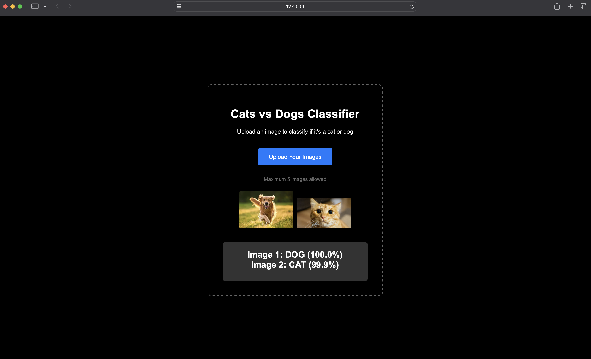

# Cats vs Dogs Classifier

A high-accuracy image classification web application that distinguishes between cats and dogs using deep learning. Built with TensorFlow and Flask, featuring a clean, professional web interface.

## Features

- **99%+ Accuracy** - Powered by MobileNetV2 transfer learning
- **Web Interface** - Professional dark-themed UI with drag-and-drop functionality
- **Batch Processing** - Upload up to 5 images simultaneously
- **Real-time Predictions** - Instant classification with confidence scores
- **Responsive Design** - Works seamlessly on desktop and mobile devices

## Demo



## Quick Start

### Prerequisites

- Python 3.7+
- pip package manager

### Installation

1. Clone the repository:
```bash
git clone https://github.com/Anand0295/cats-vs-dogs-classifier.git
cd cats-vs-dogs-classifier
```

2. Install dependencies:
```bash
pip install -r requirements.txt
```

3. Train the model (optional - pre-trained model included):
```bash
python main.py
```

4. Launch the web application:
```bash
python app.py
```

The application will automatically open in your default browser at `http://127.0.0.1:5000`

## Usage

1. **Upload Images**: Click the "Upload Your Images" button and select up to 5 images
2. **View Results**: The application displays each image with its classification and confidence score
3. **Supported Formats**: JPG, JPEG, PNG image files

## Technical Details

### Model Architecture
- **Base Model**: MobileNetV2 (pre-trained on ImageNet)
- **Transfer Learning**: Fine-tuned for binary classification
- **Input Size**: 224x224 RGB images
- **Output**: Binary classification with confidence scores

### Technology Stack
- **Backend**: Flask (Python web framework)
- **Machine Learning**: TensorFlow/Keras
- **Frontend**: HTML5, CSS3, JavaScript
- **Image Processing**: PIL (Python Imaging Library)

### Performance
- **Validation Accuracy**: 98.9%
- **Training Time**: ~5 minutes on standard hardware
- **Inference Speed**: <1 second per image

## Project Structure

```
cats-vs-dogs-classifier/
├── app.py              # Flask web application
├── main.py             # Model training script
├── model/              # Trained model files
├── templates/
│   └── index.html      # Web interface
├── requirements.txt    # Python dependencies
└── README.md          # Project documentation
```

## Model Training

The model uses transfer learning with MobileNetV2:

1. **Data**: Microsoft Cats and Dogs dataset (automatically downloaded)
2. **Preprocessing**: Images resized to 224x224, normalized for MobileNetV2
3. **Training**: 5 epochs with Adam optimizer
4. **Validation**: 20% split for performance evaluation

To retrain the model:
```bash
python main.py
```

## API Endpoints

### POST /predict
Upload images for classification

**Request**: Multipart form data with image files
**Response**: JSON array with predictions and confidence scores

```json
{
  "results": [
    {
      "prediction": "CAT",
      "confidence": "99.1%",
      "filename": "cat_image.jpg"
    }
  ]
}
```

## Contributing

1. Fork the repository
2. Create a feature branch (`git checkout -b feature/improvement`)
3. Commit your changes (`git commit -am 'Add new feature'`)
4. Push to the branch (`git push origin feature/improvement`)
5. Create a Pull Request

## License

This project is licensed under the MIT License - see the [LICENSE](LICENSE) file for details.

## Acknowledgments

- Microsoft for the Cats and Dogs dataset
- TensorFlow team for MobileNetV2 architecture
- Flask community for the web framework

## Contact

For questions or suggestions, please open an issue or contact [anandstudnt@gmail.com](mailto:anandstudnt@gmail.com)

---

**Built with ❤️ using TensorFlow and Flask**Note: Run 'python main.py' first to train the model before using the web interface.
